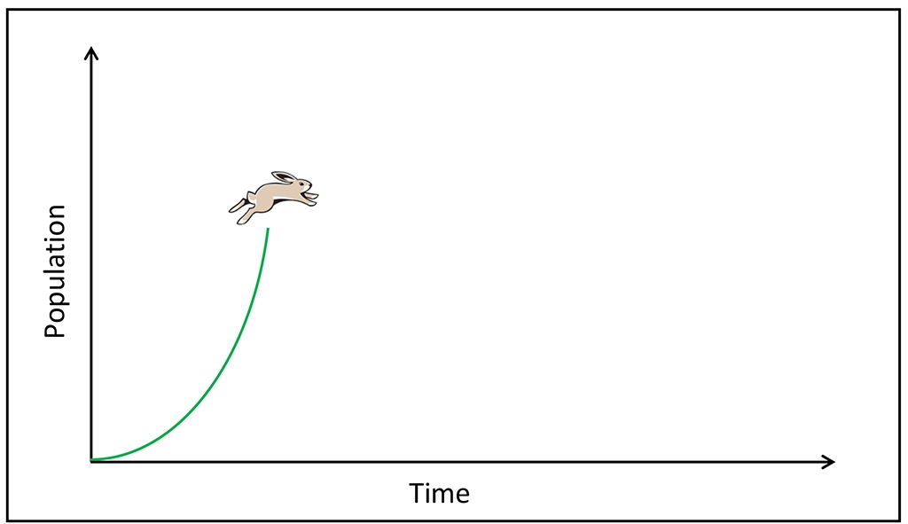
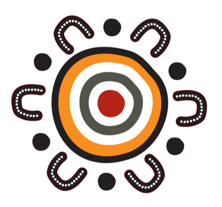

# Welcome to Professor [Corey Bradshaw's](http://GlobalEcologyFlinders.com/people/#CJAB) GitHub repositories
 

This page is a synopsis of the main [Github](https://github.com/cjabradshaw/) repositories, their applications, examples, and links I've created. I've grouped them by theme, with a brief summary of topic in each entry. More detailed descriptions are available in the repositories themselves.

Need help? Don't hesitate to contact me [here](mailto:corey.bradshaw@flinders.edu.au).

 

## Code by topic

### _Animal Population Dynamics_ 
- [stochastic models for predicting feral cat eradication and costs on large islands](https://github.com/cjabradshaw/FeralCatEradication)
- [stochastic demographic models for Sahul megafauna species](https://github.com/cjabradshaw/MegafaunaSusceptibility)
- [whaler shark (_Carcharhinus brachyurus_) sustainable harvest mode](https://github.com/cjabradshaw/WhalerSharkModel)

### _Invasive Species_ 
- [estimating the cost of invasive species to Australia](https://github.com/cjabradshaw/InvasiveSppCostsAustralia)

### _Human Population Dynamcis & Movement_ 
- [cellular-automaton model of human spread across Sahul](https://github.com/cjabradshaw/SahulHumanSpread)
- [age-structured models of ancient humans entering Sahul](https://github.com/cjabradshaw/SahulHuman)
- [matrix projection models for the global human population](https://github.com/cjabradshaw/globalhumanmodel)

### _Environmental Quality_ 
- [relationships between environmental degradation and socio-economic variables among African nations](https://github.com/cjabradshaw/EnvironRankAfrica)

### _Health & Disease_ 
- [socio-economic and environmental determinants of child-health outcomes among African nations](https://github.com/cjabradshaw/AfricaChildHealth)
- [estimating effects of temporal distancing to reduce infection risk](https://github.com/cjabradshaw/COVID19distancing)
- [predicting the interaction between diseases for European rabbits to maximise biological control](https://github.com/cjabradshaw/diseasesynergy)

### _Bibliometrics_  
- [ranking researchers fairly by citation performance (the '_ε_-index')](https://github.com/cjabradshaw?tab=repositories)
- [ranking journals using multiple citation indices](https://github.com/cjabradshaw/JournalRanks)
- [100 papers every ecologist should read](https://github.com/cjabradshaw/HIPE)

### _Sharks_  
- [deterrent trials for devices used to reduce the incidence of white shark (_Carcharodon carcharias_) attacks](https://github.com/cjabradshaw/whitesharkdeterrents)
- [predicting shark bites in Australia](https://github.com/cjabradshaw/sharkbite)
- [whaler shark (_Carcharhinus brachyurus_) sustainable harvest mode](https://github.com/cjabradshaw/WhalerSharkModel)

